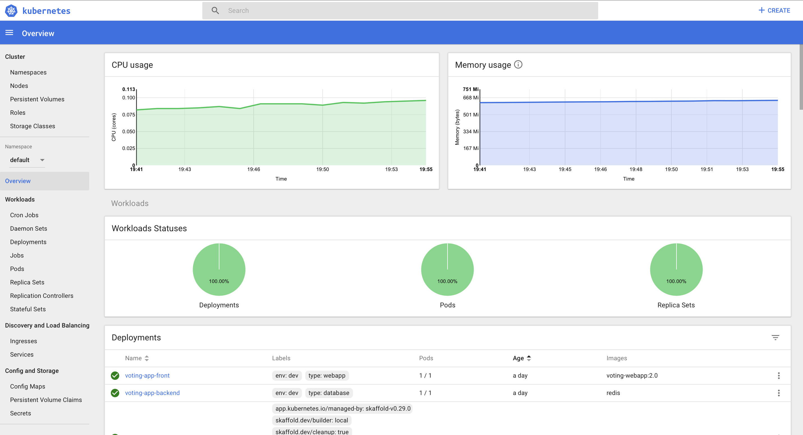

# Kubernetes Workshop

This repository contains setup instructions and hands-on labs for the [Kubernetes Workshop](https://www.eventbrite.com/e/building-microservices-using-kubernetes-hands-on-workshop-online-attendence-option-available-tickets-61595687359).
This workshop is led by [Razi Rais](https://www.linkedin.com/in/razirais)

**In order to perfrom tasks in this workshop you're expected to have a working knowledge of Linux command line and basic understanding of Docker containers.**

## Prerequisites 
> Approximate time to complete this task is 20 minutes

In this training we will use [minikube](https://kubernetes.io/docs/getting-started-guides/minikube/) to run a local Kubernetes cluster. We will access this local Kubernetes cluster with the client tool  `kubectl`.

 * Clone the repo: 
 ``` git clone  https://github.com/razi-rais/microservices.git && cd microservices/workshop  ```

> NOTE: Following software are compatiable with Linux, Mac OS X and Windows operating system. During the minikube setup you will need to install a hypervisor that will run the minikube vm. Recommendation to use [virtualbox](https://www.virtualbox.org) as a hypervisor. 

* Install Docker (Stable Version).  [Mac](https://docs.docker.com/docker-for-mac/install/) |[Linux](https://docs.docker.com/install/) | [Windows](https://docs.docker.com/docker-for-windows/install/)

Verfiy the Docker installation:
```
$ docker version
Client: Docker Engine - Community
 Version:           18.09.2
 API version:       1.39
 Go version:        go1.10.8
 Git commit:        6247962
 Built:             Sun Feb 10 04:12:39 2019
 OS/Arch:           darwin/amd64
 Experimental:      false

Server: Docker Engine - Community
 Engine:
  Version:          18.09.2
  API version:      1.39 (minimum version 1.12)
  Go version:       go1.10.6
  Git commit:       6247962
  Built:            Sun Feb 10 04:13:06 2019
  OS/Arch:          linux/amd64
  Experimental:     false

```
* Install [Minikube](https://kubernetes.io/docs/tasks/tools/install-minikube) (This link contains step by step insructions to setup Minikube on variety of operating system)

* Install [kubectl](https://kubernetes.io/docs/tasks/tools/install-kubectl/) (This link contains step by step insructions to setup Minikube on variety of operating systems)


After successfull installation of minikube and kubectl verfiy the setup:
```
$ minikube version
minikube version: v1.0.1
```

Now, start the minikube. Please note that ```--vm-driver``` parameter is dependent on the type of hypervisor used during the minikube setup. Following example is using virtualbox as a hypervisor but you may need to change the value depending on your choice of the hypervisor.

```
$ minikube minikube start --vm-driver=virtualbox

😄  minikube v1.0.1 on darwin (amd64)
🤹  Downloading Kubernetes v1.14.1 images in the background ...
💡  Tip: Use 'minikube start -p <name>' to create a new cluster, or 'minikube delete' to delete this one.
🏃  Re-using the currently running virtualbox VM for "minikube" ...
⌛  Waiting for SSH access ...
📶  "minikube" IP address is 192.168.99.102
🐳  Configuring Docker as the container runtime ...
🐳  Version of container runtime is 18.06.3-ce
⌛  Waiting for image downloads to complete ...
✨  Preparing Kubernetes environment ...

$ minikube status 

host: Running
kubelet: Running
apiserver: Running
kubectl: Correctly Configured: pointing to minikube-vm at 192.168.99.102

$ kubectl version

Client Version: version.Info{Major:"1", Minor:"14", GitVersion:"v1.14.1", GitCommit:"b7394102d6ef778017f2ca4046abbaa23b88c290", GitTreeState:"clean", BuildDate:"2019-04-19T22:12:47Z", GoVersion:"go1.12.4", Compiler:"gc", Platform:"darwin/amd64"}
Server Version: version.Info{Major:"1", Minor:"14", GitVersion:"v1.14.1", GitCommit:"b7394102d6ef778017f2ca4046abbaa23b88c290", GitTreeState:"clean", BuildDate:"2019-04-08T17:02:58Z", GoVersion:"go1.12.1", Compiler:"gc", Platform:"linux/amd64"}
```

You can take minikube to a test drive right away to make sure things are working as expected! Let us run a nginx server in a kubernetes way.

```
$ kubectl run ngx --image=nginx --labels="type=webserver" 
```

Now run the command to see the pod running the nginx container.

```
$  kubectl get po -l type=webserver
NAME                   READY   STATUS    RESTARTS   AGE
ngx-5f48d9f7f5-xzxtz   1/1     Running   0          10s
```

Also, behind the scenes the run command created a Kubernetes deployment for you. 

```
$  kubectl get deployment ngx
NAME   READY   UP-TO-DATE   AVAILABLE   AGE
ngx    1/1     1            1           11s
```

Everthing is working as expected. Now you going to access the nginx using some form of a URL. After all its a webserver! In order to do that, first you need to expose the pod using the Kubernetes service. 

```
$ kubectl expose deployment ngx --type=NodePort --port=80 
```

Verify that service has been created successfully.
```
$kubectl get svc -l type=webserver -o wide
NAME   TYPE       CLUSTER-IP       EXTERNAL-IP   PORT(S)        AGE   SELECTOR
ngx    NodePort   10.106.191.246   <none>        80:32624/TCP   17s   type=webserver
```

With the service available you can get the URL to access the serice using an endpoint that will direct the traffic to the nginx pod!

```
$ minikube service ngx --url
http://192.168.99.102:32624
```
Now use curl/wget/browser to access the nginx.

```
$ curl $(minikube service ngx --url)

<!DOCTYPE html>
<html>
<head>
<title>Welcome to nginx!</title>
<style>
    body {
        width: 35em;
        margin: 0 auto;
        font-family: Tahoma, Verdana, Arial, sans-serif;
    }
</style>
</head>
<body>
<h1>Welcome to nginx!</h1>
<p>If you see this page, the nginx web server is successfully installed and
working. Further configuration is required.</p>

<p>For online documentation and support please refer to
<a href="http://nginx.org/">nginx.org</a>.<br/>
Commercial support is available at
<a href="http://nginx.com/">nginx.com</a>.</p>

<p><em>Thank you for using nginx.</em></p>
</body>
</html>
```

Alright, that was good but you may be wondering shouldn't there be a declarative way to define Pod, Deployment and Service? Perhaps using YAML or JSON format. That is a valid point and typically declarative style works better in most cases. It also aligns well with the "Infrastrucre as a Code" theme that is common in the DevOps community. For the reminder of the labs you will be using YAML files to create Pods, Deployments, Services etc. You can learn more about the trade offs between imperative and declrative methods while working with Kubernetes objects [here](https://kubernetes.io/docs/concepts/overview/object-management-kubectl/imperative-command/#trade-offs)

To view to the YAML/JSON definition of the Kubernetes objects created in previous steps you can use -o (output) swtich and get the definition of a particular object in YAML or in JSON format.

For example get the definition of deployment in YAML
```
$ kubectl get deployment ngx -o yaml

apiVersion: extensions/v1beta1
kind: Deployment
metadata:
  annotations:
    deployment.kubernetes.io/revision: "1"
  creationTimestamp: "2019-05-17T17:18:07Z"
  generation: 1
  labels:
    type: webserver
  name: ngx
  namespace: default
  resourceVersion: "101467"
  selfLink: /apis/extensions/v1beta1/namespaces/default/deployments/ngx
  uid: bcfc77dc-78c7-11e9-8278-08002732c767
.....(Output truncated for brevity)
```

## Build, Package, Deploy and Run a multi-container application with Kubernetes

> Approximate time to complete this task is 30 minutes

In this section you will build, package, deploy and run a multi-container application to a minikube Kubernetes locally. Later, you will learn how scale and perform rolling update to it using Kubernetes. 

Let's review the application. Its a simple python web application that provides you with an option to vote for your favorite animal (cats or dogs). The voting results are store in a Redis cache. 

The UI is shown below:
 
 
 You can review the code artifacts by browsing the directory: ```voting-app```. You can take a peek at it now but considering that its a very basic python code we won't spend time going into any details.

Let's focus on the Kubernetes artifacts and view them conceptually as they fit into Kubernetes architecture. 

#### Voting Application | Front End WebApp

Let's look at the bigger picture. Here is the story its tells --

 *End user sends a request to http://127.0.0.1:21516 endpoint to access the voting web app. Kubernetes voting service is running on a local minikube Kubernetes cluster that is listening to that endpoint. It acknowledge the request and check if any pod has labels that matches "type:webapp, env: dev" and if there are it route the request to that pod at port 80. Pod takes the request and route it to a container which is running application on port 80. Web app process the request and send the reponse back.*


Right at the center you have a WebApp (packaged and running as a container). This is the python webapp that you will package as a Docker container shortly. The container itself resides in a pod. Pod is a basic object iniside Kubernetes and unlike Docker you cannot run container without having a pod. Pod also allows you to add  miscellaneous pieces of information like labels to it. Label helps you to tag information to a pod in a key/value format. We have labels ```type: webapp``` and ```env: dev``` assigned to the pod. Pods are usually defined inside a ```Deployment``` to get the benefit of rolling updates and ensuring you always have certain number of pods running in the cluster to get high availablity. Kubernetes use a concept of replica-set to ensure minium number of pods are always running. 

You can review the contents of ```voting-app-front-dep.yaml ``` to get a sense of how pod, container, labels and relicas are defined inside a deployment definition. Below is the summary of most releveant parts:

| Type   |      Value      |  Details |
|----------|:-------------:|------:|
| name  | voting-app-front |  Name of the pod|
| labels |    env: dev , env: webapp   |   Labels associated with the pod|
| containers | image: voting-webapp:1.0 |   Container image name to run |
| containers | name: webfront | Mame of the container|

```
apiVersion: apps/v1beta1
kind: Deployment
metadata:
  name: voting-app-front
spec:
  replicas: 1
  strategy:
    rollingUpdate:
      maxSurge: 1
      maxUnavailable: 1
  minReadySeconds: 5 
  template:
    metadata:
      labels:
        env: dev
        type: webapp
    spec:
      nodeSelector:
        "beta.kubernetes.io/os": linux
      containers:
      - name: webfront
        image: voting-webapp:1.0
        imagePullPolicy: Never
        ports:
        - containerPort: 80
        resources:
          requests:
            cpu: 250m
          limits:
            cpu: 500m
        env:
        - name: REDIS
          value: "voting-backend"
```

Another important Kubernetes object is the ```Service```. It is responsibe to route traffic to the Pod and ultimately to the container. Our webapp runs on port 80 inside the pod. This is fine but as-is it won't be easily accessaible to you because Kubernetes run a internal cluster network so IPs and access to it is not easy. This is where service comes into the picture. We are using service definition ```voting-app-front-dep.yaml ``` that asks Kubernetes to open a port on a Kubernetes node (which is a the minikube virtual machine in our case). But how does services knows which Pod to route traffic to? It uses labels! This can sound strange at first but service has no direct ties to the Pod at all. Its all losely coupled a service selects pods to route traffic to based on labels defined in the service definition file. In our case the labels are ``` type:webapp``` and ``` env:dev```. Also the ```type: NodePort``` means that Kubernetes will use a higher value port (typically in the range of 300000+) on the Node and listen it and then route it to port 80 as define by ```port:80``` within the ```ports```.  

```
apiVersion: v1
kind: Service
metadata:
  name: voting-front
spec:
  type: NodePort
  ports:
  - port: 80
  selector:
    type: webapp
    env: dev
```

#### Voting Application | Backend 
The backend deployment defines a pod that runs a redis cache. It has labels ```type: database``` and ``` env: dev``` assigned to it.  


You can review the contents of ```voting-app-back-dep.yaml ``` to get a sense of how pod, container, labels and relicas are defined inside a deployment definition. Below is the summary of most releveant parts:

| Type   |      Value      |  Details |
|----------|:-------------:|------:|
| name  | voting-app-backend |  Name of the pod|
| labels |    env: dev , env: database   |   Labels associated with the pod|
| containers | image: redis |   Container image redis (available from Docker Hub) |
| containers | name: backend | Mame of the container|

```
apiVersion: apps/v1beta1
kind: Deployment
metadata:
  name:  voting-app-backend
spec:
  replicas: 1
  template:
    metadata:
      labels:
        type: database 
        env: dev
    spec:
      nodeSelector:
        "beta.kubernetes.io/os": linux
      containers:
      - name: backend
        image: redis
        ports:
        - containerPort: 6379
          name: redis
```

We also have ```voting-app-back-svc.yaml ``` that defines the service to expose the redis cache. It is needed because voting front end webapp is running in a different pod and won't able to access it otherwise. Also note that unlike the front end service it does expose the service to Kubernetes Node. The reason is simple - we are not expecting anyone outside voting front end webapp to connect to it!  

```
apiVersion: v1
kind: Service
metadata:
  name: voting-backend
spec:
  ports:
  - port: 6379
  selector:
    type: database
    env: dev
```
### Packaging voting-app as a container

We start by packaging voting-app as a container container image. This is a simple webapp so Dockerfile is very basic as shown below. Basically are using flask base image and then install redis pacakge. Finally, we copy the code files residing inside the ```voting-app``` directory to the ```app``` directory inside the container image (it will be created automatically if not exists alredy).

````
FROM tiangolo/uwsgi-nginx-flask:python3.6
RUN pip install redis
ADD /voting-app /app
````

Now, build the container image:

```
$ docker build -t voting-webapp:1.0 -f Dockerfile.voting-app .

Sending build context to Docker daemon   42.5kB
Step 1/3 : FROM tiangolo/uwsgi-nginx-flask:python3.6
 ---> 80478e7b12fc
Step 2/3 : RUN pip install redis
 ---> Using cache
 ---> 7ae0710ee5d2
Step 3/3 : ADD /voting-app /app
 ---> Using cache
 ---> 626972034c28
Successfully built 626972034c28
Successfully tagged voting-webapp:1.0
```

> IMPORTTANT: Since minikube is running inside a virtual machine it's really handy to reuse the Docker daemon inside that virtual machine; as this means you don't have to build on your host machine and push the image into a docker registry. All you need to do is run the command ```eval $(minikube docker-env)```. More details [here](https://github.com/kubernetes/minikube/blob/0c616a6b42b28a1aab8397f5a9061f8ebbd9f3d9/README.md#reusing-the-docker-daemon)

That's it as far as building the container images for our voting app goes. Backend is just a redis cache and Docker Hub already has an [offfical Redis image](https://hub.docker.com/_/redis) for that. 

#### Deploying Kubernetes Artifacts 

We start with the backend. Simply because redis is used to store the of the voting results and without it voting web app won't work.

The ```apply``` command is used to tell kubernetes to create new deployment object as define inside ```voting-app-back-dep.yaml ```. 

```
$ kubectl apply -f voting-app-back-dep.yaml 
```

Verify the deployment was successful and pod is up and running.
```
$ kubectl get deployment voting-app-backend 
NAME                 READY   UP-TO-DATE   AVAILABLE   AGE
voting-app-backend   1/1     1            1           68s

$ kubectl get po -l type=database
NAME                                READY   STATUS    RESTARTS   AGE
voting-app-backend-f77bd6f4-f5gkd   1/1     Running   0          93s

```

Next, let us create the service so front-end web app can access the backend. Remember redis and webapp are running in two different pods and need to communicate via service endpoint. 

```
$ kubectl apply -f voting-app-back-svc.yaml 

$ kubectl get svc voting-backend 
NAME             TYPE        CLUSTER-IP     EXTERNAL-IP   PORT(S)    AGE
voting-backend   ClusterIP   10.96.191.22   <none>        6379/TCP   41s
```

At this point the backend work is done. We can now begin deploying the front end webapp.

```
$ kubectl apply -f voting-app-front-dep.yaml 
```

Verify that the deplpoyment is successfull and pod is running.

```
$ kubectl get deployment voting-app-front
NAME               READY   UP-TO-DATE   AVAILABLE   AGE
voting-app-front   1/1     1            1           16m

$ kubectl get po -l type=webapp

NAME                                READY   STATUS    RESTARTS   AGE
voting-app-front-596476c4c6-6nqfj   1/1     Running   0          6m15s
```

```
$ kubectl apply -f voting-app-front-svc.yaml 

$ kubectl get service voting-front
NAME           TYPE       CLUSTER-IP       EXTERNAL-IP   PORT(S)        AGE
voting-front   NodePort   10.102.202.223   <none>        80:32636/TCP   10s
```

#### Testing the voting app

You need to get the endpoint URL to access the voting app. This is exposed by the voting-front service. The easist way to get to it is by using ```minikube service``` command: 

```
$ minikube service voting-front --url
http://192.168.99.102:32636
```
Open the browser and navigate to the URL. You should see the UI as shown below. Voting app is now functional! 

 

## Scaling Deloyment

> Approximate time to complete this task is 5 minutes

Currently we have only one pod running our webapp. In case there is more traffic comming in you may want to run mulitple pods. This is done by scaling the deployment to run more pods. Kubernetes uses the concept of [ReplicaSet](https://kubernetes.io/docs/concepts/workloads/controllers/replicaset) to provide guarantee to always run minimun number of Pod. This is essentially the reson why you have single pod at the moment. If you open the ```voting-app-front-dep.yaml``` you will notice the entry  ```replicas:1```. This tell kubernetes to always run one pod. If for some reason pod goes down Kuberentes will run a new pod to bring the repilica count to 1. 

Scaling to muliptle replicas can be done using ```kubectl scale``` command. ```---replicas``` swtich defines how many pods you like to run. Run the command to increase the replica count for voting-front app to 2 and then see view pods. You can also scale back to one pods as/when by running the command again with ```replicas=1```.

```
$ kubectl scale --replicas=2 deployment/voting-app-front
deployment.extensions/voting-app-front scaled

$ kubectl get po -l type=webapp 
NAME                                READY   STATUS    RESTARTS   AGE
voting-app-front-5f869574b7-lk6mr   1/1     Running   0          35h
voting-app-front-5f869574b7-wk8rl   1/1     Running   0          20s
```

## Rolling updates

> Approximate time to complete this task is 10 minutes

Let's make a minor change to the voting front web app and see how we can deploy the application again without downtime!

Beging by change the title of the webapp from "Awesome Voting App" to "Awesome Voting App v2" by editing file ```config_file.cfg``` located inside ```/voting-app``` directory

**Before | config_file.cfg**
```
# UI Configurations
TITLE = 'Awesome Voting App'
VOTE1VALUE = 'Cats'
VOTE2VALUE = 'Dogs'
SHOWHOST = 'false' 
```

**After | config_file.cfg**
```
# UI Configurations
TITLE = 'Awesome Voting App v2'
VOTE1VALUE = 'Cats'
VOTE2VALUE = 'Dogs'
SHOWHOST = 'false'
```

Currently we are running ```1.0``` version of the web app as reflected by the tag field of the container image ```voting-webapp:1.0```. After the updates you build the container again with an updated tag ```voting-webapp:2.0```.

```
$ eval $(minikube docker-env)

$ docker build -t voting-webapp:2.0 -f Dockerfile.voting-app .
```

You have the new webapp container image ready. The ```voting-app-front-v2-dep.yaml``` is a new deployment file which is identical to the one that is currently deployed except that it has an image field set to the new container image ```image: voting-webapp:2.0```. 

```
apiVersion: apps/v1beta1
kind: Deployment
metadata:
  name: voting-app-front
spec:
  replicas: 1
  strategy:
    rollingUpdate:
      maxSurge: 1
      maxUnavailable: 1
  minReadySeconds: 5 
  template:
    metadata:
      labels:
        env: dev
        type: webapp
    spec:
      nodeSelector:
        "beta.kubernetes.io/os": linux
      containers:
      - name: webfront
        image: voting-webapp:2.0
.......(Output truncated for brevity)
```

Also, its important to highlight the ```strategy``` section in the deployment file. Basically the ```rollingUpdate``` is a type of update stragey which specify ```maxUnavailable``` and ```maxSurge``` to control the rolling update process. The  ```maxUnavailable``` specifies the maximum number of Pods that can be unavailable during the update process and it is set to ```1``` meaning only single pod can be down at any point in time during the update process. Also, ```maxSurge``` specifies the maximum number of Pods that can be created over the desired number of Pods and currently it is set to ```1``` which means only one Pod will be added at a time. In a nutshell with this definition we always have at least one pod running making sure in comming traffic don't get disrupted. You can learn more about various options available for the strategy [here](https://kubernetes.io/docs/concepts/workloads/controllers/deployment/#strategy)

Its time to go head and perfrom the rolling update!

```
$ kubectl apply -f voting-app-front-v2-dep.yaml 
```

Refresh the voting web app and you should see the updates in action.

 

Although the deployed worked out fine we are now going to roll it back to the last version. This is useful when things don't go according to plan. Rolling back is simple you basically point out to the deployment and use the ```rollout``` command with the ```undo``` parameter.

```
$ kubectl rollout undo deployment/voting-app-front
```


## Visualize performance monitoring using Grafana and Kubernetes Dashboard 

> Approximate time to complete this task is 10 minutes

### Grafana

To view the performace monitoring metrics in Kubernetes Grafana provides a popular visualization dashboard. This is done by enabling Heapster addon which provides multi-level monitoring and performance analysis including pods, nodes, and cluster.

Behind the scenes, it leverages InfluxDB as the storage backend for metric data and Grafana as visualization UI.

```
$ minikube addons enable heapster
✅  heapster was successfully enabled
```

Once the addon is installed you can access the Grafana UI using one of the following commands:

Option-1
```
$ minikube addons open heapster
```

Option-2
Use the URL of the service endpoint to access the Grafana UI.
```
$ minikube service monitoring-grafana --url -n=kube-system
http://192.168.99.102:30002
```

Either way you should able to land on the Grafana UI.

 

From the top pane select "Home" and then select "Pods".

 

You will be taken to a dashbord displaying various peformance related metrics like individual pod CPU, memory, network and filesystem usage. Change the namespace from ```kube-system``` to ```default``` and then select voting-front-app pod. The dashboard will update automatically to reflect the values related to the pod. 

 

### Kubernetes Dashboard

```
$ minikube addons enable dashboard
✅  dashboard was successfully enabled
```

You can open the Kubernetes dashboard by running a simple command:
```
$ minikube addons open dashboard
```
 

> NOTE: If for some reason you don't see the dasboard opening up in the browser then use```port-forwarding``` command shown below. 

First capture the name of the pod running the dashboard application. 

```
$ kubectl get po -n kube-system -l "app=kubernetes-dashboard"  
NAME                                    READY   STATUS    RESTARTS   AGE
kubernetes-dashboard-79dd6bfc48-4c527   1/1     Running   4          8d
```
Now start port-forwarding traffice to that pod.

```
$ kubectl port-forward kubernetes-dashboard-79dd6bfc48-4c527 -n kube-system 9090:9090
Forwarding from 127.0.0.1:9090 -> 9090
Forwarding from [::1]:9090 -> 9090
```
Open the browser and navigate to ```http://127.0.0.1:9090``` to access the dashboard.


## Explore Logs using EFK (Elasticsearch, Fluentd, Kibana)

```
$ kubectl logs pod_name

```
> Approximate time to complete this task is 15 minutes

This is powerful add-on consists of a combination of Elasticsearch, Fluentd and Kibana. Elasticsearch is a search engine that is responsible for storing our logs and allowing for them to be queried. Fluentd sends log messages from Kubernetes to Elasticsearch, whereas Kibana is a graphical interface for viewing and querying the logs stored in Elasticsearch.

> Note: This addon should not be used as-is in production. This is an example and you should treat it as such. Please see at least the Security and the Storage sections for more information.[here](https://github.com/kubernetes/kubernetes/tree/master/cluster/addons/fluentd-elasticsearch)

You start by enabling the EFK addon with minikube.
```
$ minikube addons enable efk
✅  efk was successfully enabled
```
It takes few seconds for all the pods related to efk to come up.
```
$ kubectl get po -n kube-system  -l "k8s-app in (fluentd-es,kibana-logging,elasticsearch-logging)"
NAME                          READY   STATUS    RESTARTS   AGE
elasticsearch-logging-rdq7p   1/1     Running   0          112m
fluentd-es-tlg5m              1/1     Running   0          112m
kibana-logging-4mh5f          1/1     Running   0          112m
```

> In the previous command you are filtering out the pods based on labels. It may seems advanced use case but its rather simple. Its a OR condition saying "give me all pods that have label ```k8s-app``` with one of the three values. This is helpful because we don't want to get everything that exists in ```kube-system``` namespace but rather focus on only the pods created by efk addons and have specefic labels. Learn more about use of labels [here](https://kubernetes.io/docs/concepts/overview/working-with-objects/labels/)
 
The pod that gives us the dashboard UI to work the the logs is the one running Kibana. You can get to the dashboard in one of the two ways (first method is preferred)

```
$ minikube service kibana-logging --url -n kube-system
http://192.168.99.102:30003
```

```
$ kubectl port-forward kibana-logging-4mh5f 5601:5601 -n kube-system
Forwarding from 127.0.0.1:5601 -> 5601
Forwarding from [::1]:5601 -> 5601

```

Now open the browser and navigate to the URL pointing to the kibana endpoint (```http://192.168.99.102:30003``` or ```http://27.0.0.1:5601``` )

On the home page you need to configure an index pattern. By default there is none so you will go ahead and configure it now.

 

Select the option "I don't want to use the Time Filter" from the dropdown and then press "Create"

 

At this point you should see the main results pane with logs from the entire Kubernetes system. 

 

Kibana provides extensive features to work with logs by using all sorts of patterns etc. For now we will keep it simple and view the logs from the pod running voting-front webapp. But first you need to select the fields that makes the most sense and are useful to the results pane.

On the Available Fields pane select 
```kubernetes.pod_name , 	kubernetes.namespace_name, log and @timestamp  ``` fields. 

 

You will see the pane on the right side showing the results now have four columns added to it. Also, click on the ```@timestamp`` column to make it sort in decending order (latest logs first) 

 


Finally, you now filter the logs that are generated by voting-front-app pod. Make sure you have name of the pod copied (you can run ```kubectl get po ``` command again to get the name of the pod). Now, go back to the Kibana ui and select "Add a filter +" option. 

Create a new filter by using ```kubernetes.pod_name``` as the field name and use the name of the voting-front-app pod as the value. Your entry should looks similar to following:

 

Finally, press the "Save" button. 

Results pane should be updated to show the logs (latest first) generated by voting-front-app pod. 

 


